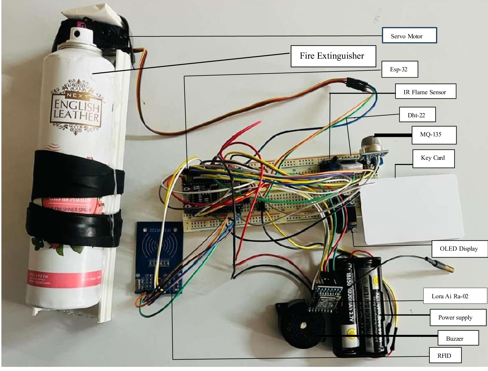
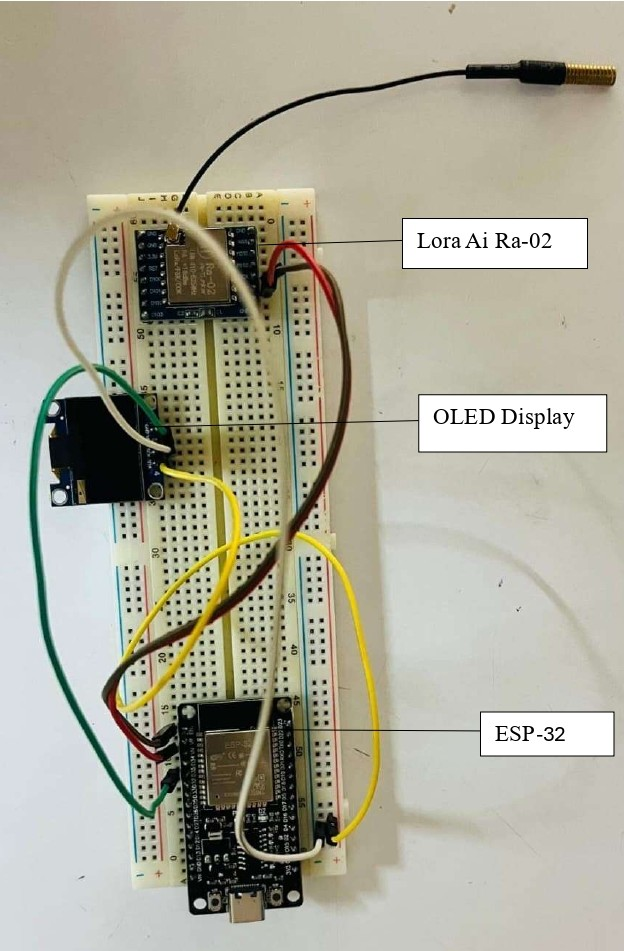

# Smart Fire Detection and Suppression System (IoT)

This project is an IoT-based fire detection and suppression system designed for real-time monitoring and response.

## Overview
The system uses ESP32 with LoRa communication to detect fire hazards and automatically trigger a response.

## Features
- Detects fire using flame, gas, and temperature sensors
- Automatic response using servo mechanism
- Long-range communication using LoRa

## Components Used
- ESP32
- LoRa module
- Flame sensor
- Gas sensor
- Temperature sensor
- Servo motor

## My Role
- Led the project development
- Designed system architecture
- Worked on sensor integration and communication

## Achievement
This project was presented at VISAI 2026 and secured **2nd Prize in the Patent Category**.

## Images

## Future Improvements
- Mobile app integration
- Cloud monitoring
