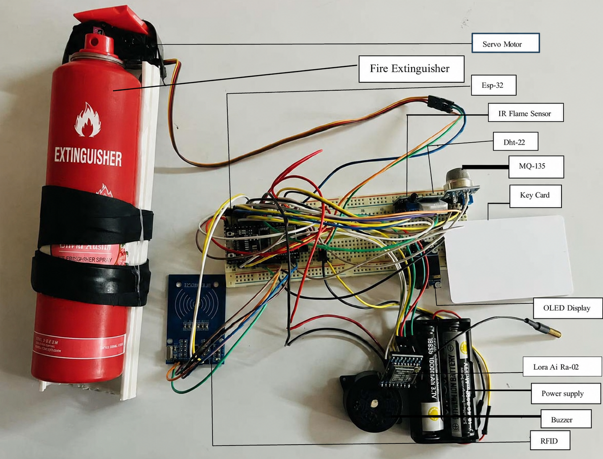
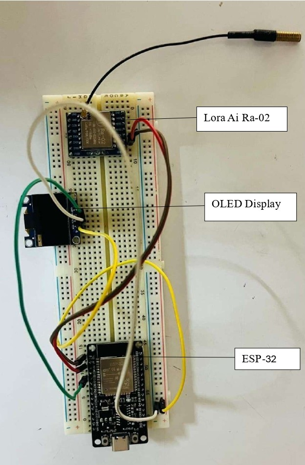
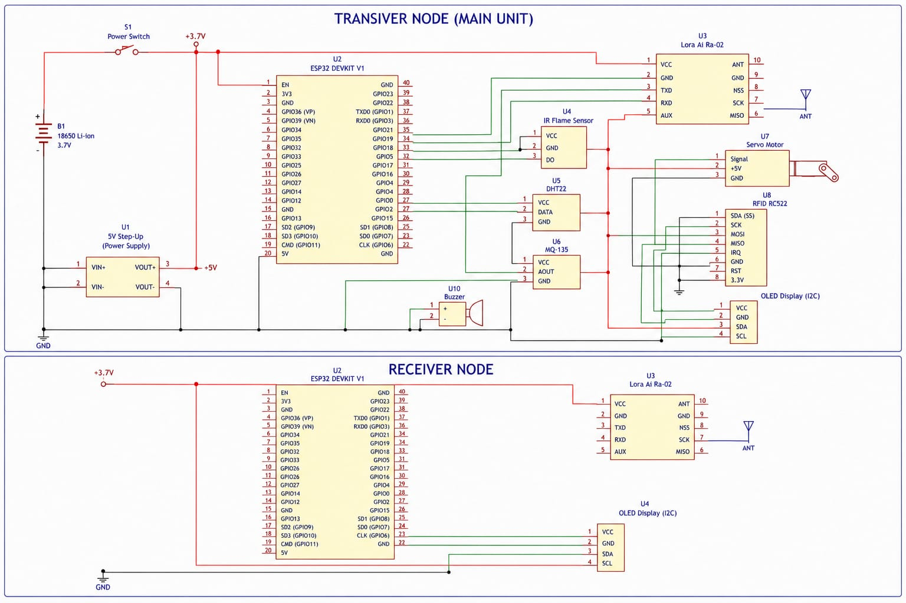

# Smart Fire Detection & Suppression System (IoT)

Fire Safety IoT system designed with ESP32 and LoRa to detect, monitor and automatically suppress fires in real time.

## Description
LoRa RA-02 modules enable communication between the transmitter and receiver nodes for long range wireless communication and the transmitter detects emergencies in the surroundings.

## Features
- Monitoring of flames, gases, temperature, humidity in real time.
- Automatic activation of fire extinguisher by servo motor.
- Long Range LoRa communication.
- Access control system with the help of RFID.
- Alerts on the site using buzzer and OLED screen.
- Remote monitoring with the help of receiver node.

## Components Used
ESP32, LoRa RA-02, IR Flame Sensor, MQ-135, DHT22, RFID RC522, Servo Motor, OLED Screen, Buzzer, and Li-Ion Power Source.

## Project Images

### Transmitter Node

### Receiver Node

### Circuit Diagram

## Contributions
Designing of architecture, implementation of LoRa communication, integration of sensors and actuators and testing and validation.

## Accomplishments
Presented at VISAI 2026 and won the **2nd Prize in Patent Category**.
